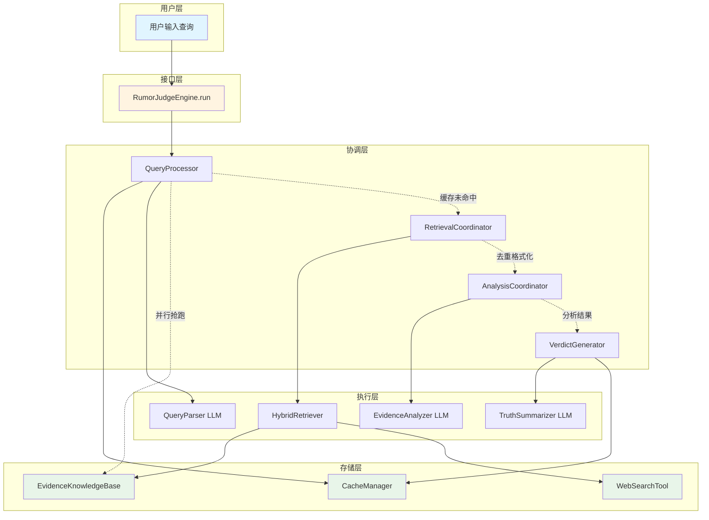
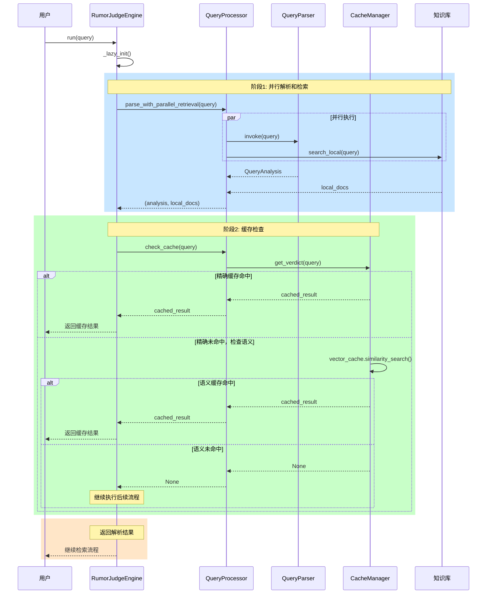
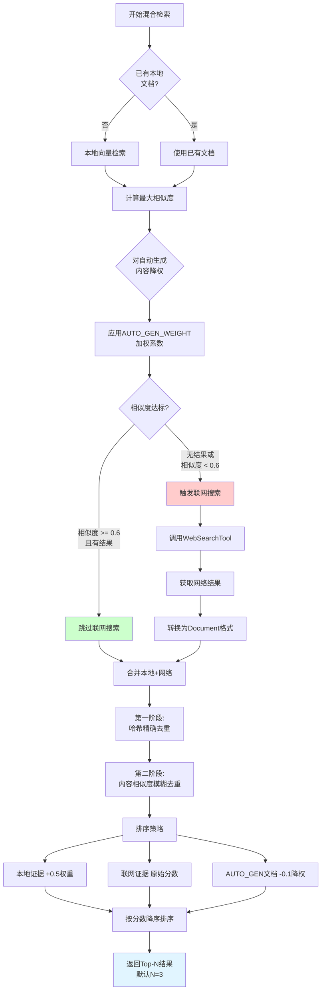
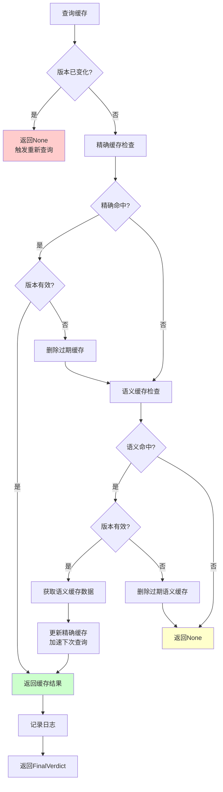
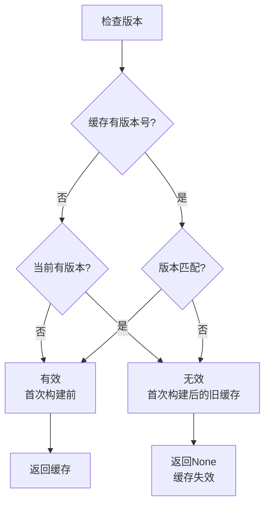
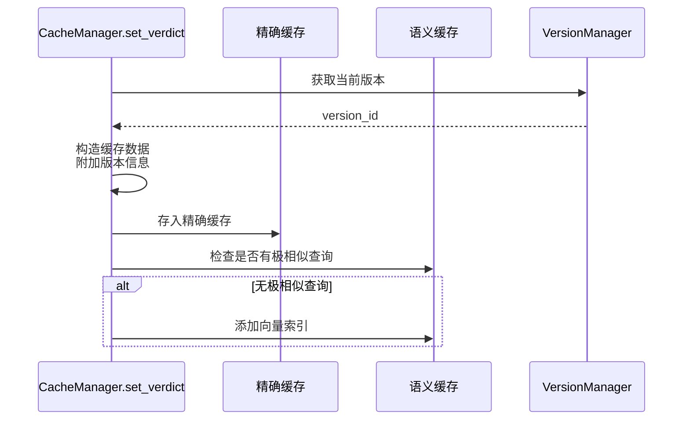
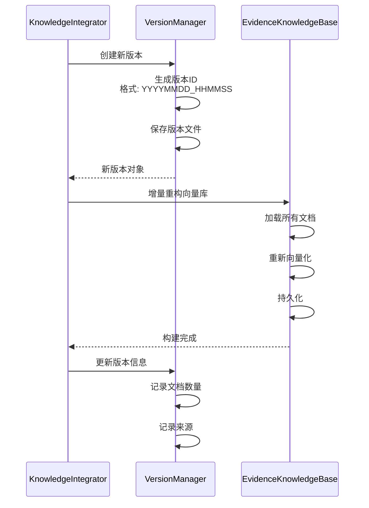
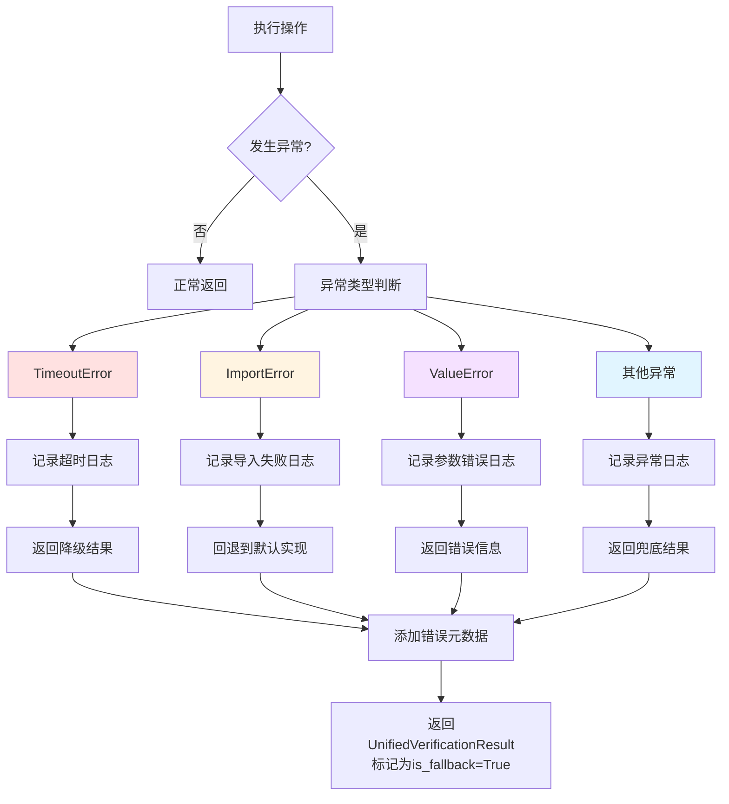

# 系统架构流程图详解

> 本文档包含互联网谣言粉碎机系统的核心流程图和架构图
>
> 生成时间: 2026-02-09

---

## 目录

1. [整体数据流](#1-整体数据流)
2. [查询处理流程](#2-查询处理流程)
3. [混合检索流程](#3-混合检索流程)
4. [证据分析流程](#4-证据分析流程)
5. [缓存系统流程](#5-缓存系统流程)
6. [知识集成流程](#6-知识集成流程)
7. [错误处理流程](#7-错误处理流程)

---

## 1. 整体数据流



**数据流说明：**

1. **用户层 → 接口层**：用户查询传入引擎
2. **接口层 → 协调层**：引擎调度各协调器
3. **协调层 → 执行层**：协调器调用具体执行器
4. **执行层 → 存储层**：执行器访问缓存和知识库
5. **存储层 → 执行层**：返回数据
6. **执行层 → 协调层**：返回处理结果
7. **协调层 → 接口层**：汇总结果
8. **接口层 → 用户层**：返回最终裁决

---

## 2. 查询处理流程



**流程说明：**

1. **并行执行**：查询解析和本地检索同时进行，节省时间
2. **抢跑策略**：用原始词提前检索，即使解析后词不同，结果也有价值
3. **双层缓存**：先精确匹配（O(1)），再语义匹配（向量检索）
4. **缓存学习**：语义命中后，将查询加入精确缓存

---

## 3. 混合检索流程



**决策逻辑说明：**

| 条件 | 动作 | 原因 |
|------|------|------|
| 无本地结果 | 联网搜索 | 本地知识不足 |
| 相似度 < 0.6 | 联网搜索 | 本地质量不足 |
| 相似度 ≥ 0.6 | 跳过联网 | 本地质量足够 |

**降权策略：**

- **自动生成内容**：乘以 `AUTO_GEN_WEIGHT`（默认0.9）
- **排序时再降权**：减去0.1，确保排在人工内容后

---

## 4. 证据分析流程

```mermaid
flowchart TD
    A[接收证据列表] --> B{证据数量?}

    B -->|1条| C[单次批量分析]
    B -->|2-5条| D[单证据并行分析]
    B -->|>5条| E[分片并行分析]

    rect rgb(200, 230, 255)
        D --> F[为每个证据<br/>创建独立任务]
        F --> G[动态计算并行度]
        G --> H[ThreadPoolExecutor]
        H --> I[并行调用LLM]
        I --> J[汇总结果]
    end

    rect rgb(255, 230, 200)
        E --> K[分片 chunk_size=2]
        K --> L[创建分片任务]
        L --> M[动态计算并行度]
        M --> N[ThreadPoolExecutor]
        N --> O[并行处理分片]
        O --> P[汇总所有分片结果]
    end

    rect rgb(200, 255, 200)
        C --> Q[单次LLM调用]
        Q --> R[返回结果]
    end

    J --> S[按ID排序]
    P --> S
    R --> S

    S --> T[返回分析结果]

    style D fill:#e1f5ff
    style E fill:#ffe1f5
    style C fill:#e1ffe1
```

**并行策略选择：**

| 证据数 | 策略 | 原因 |
|--------|------|------|
| 1 | 单次调用 | 无需并行 |
| 2-5 | 单证据并行 | 每个证据独立，粒度细，容错好 |
| >5 | 分片并行 | 避免创建过多线程，降低开销 |

**动态并行度计算：**

```python
max_workers = get_parallelism_config().get_adaptive_workers(
    task_count=len(evidence_list),
    task_type='evidence_analyzer',
    min_workers=1
)
```

---

## 5. 缓存系统流程



**版本检查逻辑：**



**缓存写入流程：**



---

## 6. 知识集成流程

```mermaid
flowchart TD
    A[核查完成] --> B{满足自动<br/>集成条件?}

    B -->|否| C[跳过集成]
    B -->|是| D[检查准入门槛]

    D --> E{裁决为"真"或"假"?}
    E -->|否| C
    E -->|是| F{置信度 >= 90%?}

    F -->|否| C
    F -->|是| G{证据数 >= 3?}

    G -->|否| C
    G -->|是| H[启动后台集成线程]

    H --> I[获取知识集成锁]
    I --> J{获取成功?}
    J -->|否| K[跳过<br/>已有任务运行]
    J -->|是| L[生成知识内容]

    L --> M[构造AUTO_GEN<br/>文件名]
    M --> N[写入知识文件]

    N --> O[增量重构向量库]
    O --> P[更新版本号]

    P --> Q[释放锁]
    Q --> R[日志记录完成]

    style H fill:#e1f5ff
    style K fill:#ffcccc
    style R fill:#ccffcc
```

**准入门槛（严格模式）：**

| 条件 | 阈值 | 原因 |
|------|------|------|
| 裁决类型 | "真"或"假" | 避免模糊内容 |
| 置信度 | ≥ 90% | 确保高可靠性 |
| 证据数 | ≥ 3 | 确保有充分证据 |
| 是否联网 | 是 | 确保是新知识 |

**文件命名规范：**

```
AUTO_GEN_{timestamp}_{safe_title}.txt

示例：
AUTO_GEN_1707521234维生素C防感冒.txt
```

**版本更新：**



---

## 7. 错误处理流程



**错误处理策略：**

| 异常类型 | 处理策略 | 示例 |
|---------|---------|------|
| `TimeoutError` | 记录日志，返回降级结果 | 获取锁超时，跳过操作 |
| `ImportError` | 回退到默认实现 | 协调器不可用，使用legacy代码 |
| `ValueError` | 返回错误信息 | 参数验证失败 |
| 其他异常 | 返回兜底结果 | LLM调用失败，使用兜底裁决 |

**兜底裁决示例：**

```python
# 无证据时的兜底机制
if not evidence_list:
    verdict = summarize_with_fallback(full_claim)
    result.is_fallback = True
```

**元数据记录：**

```python
result.add_metadata(
    PipelineStage.ANALYSIS,
    False,  # success=False
    error="证据分析失败",
    duration=0
)
```

---

## 附录：图表使用指南

### Mermaid语法说明

本文档使用Mermaid图表，支持的查看器：

1. **GitHub/GitLab**：原生支持
2. **VS Code**：安装 Markdown Preview Mermaid Support 插件
3. **在线查看**：https://mermaid.live/

### 颜色方案说明

| 颜色 | 含义 |
|------|------|
| 🔵 浅蓝 | 用户接口层 |
| 🟡 浅黄 | 引擎/协调层 |
| 🟢 浅绿 | 存储层/成功路径 |
| 🔴 浅红 | 错误/警告 |
| ⚪ 灰色 | 兜底/降级 |

---

**文档版本**: v1.0
**最后更新**: 2026-02-09
