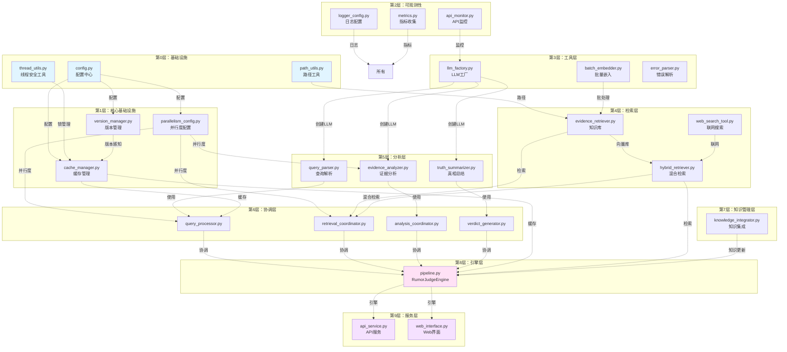
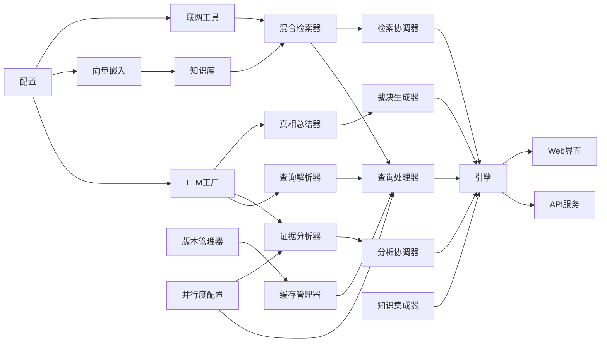
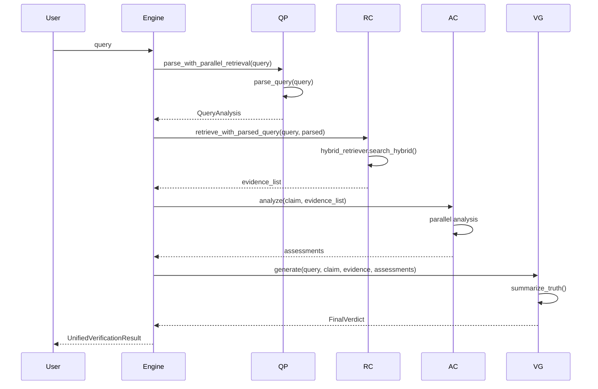
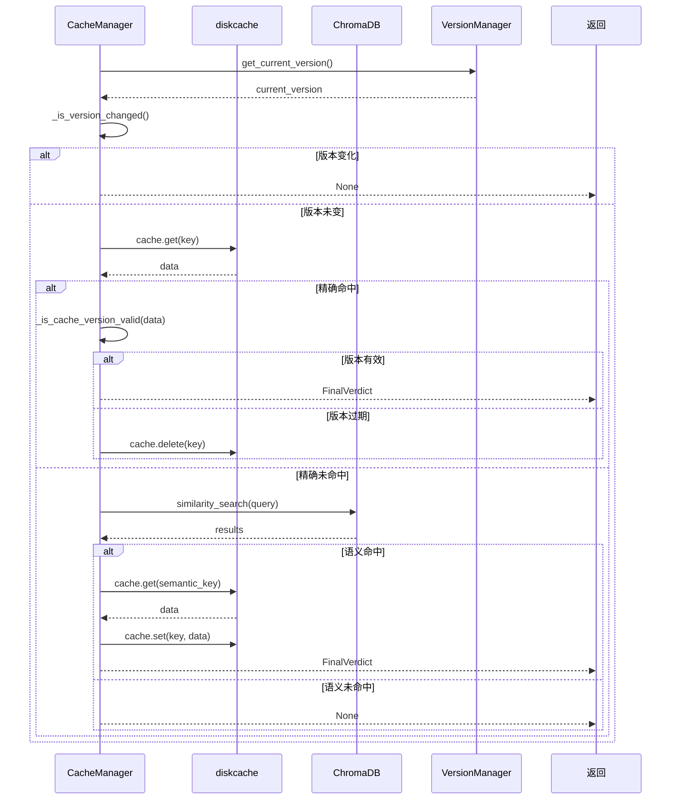
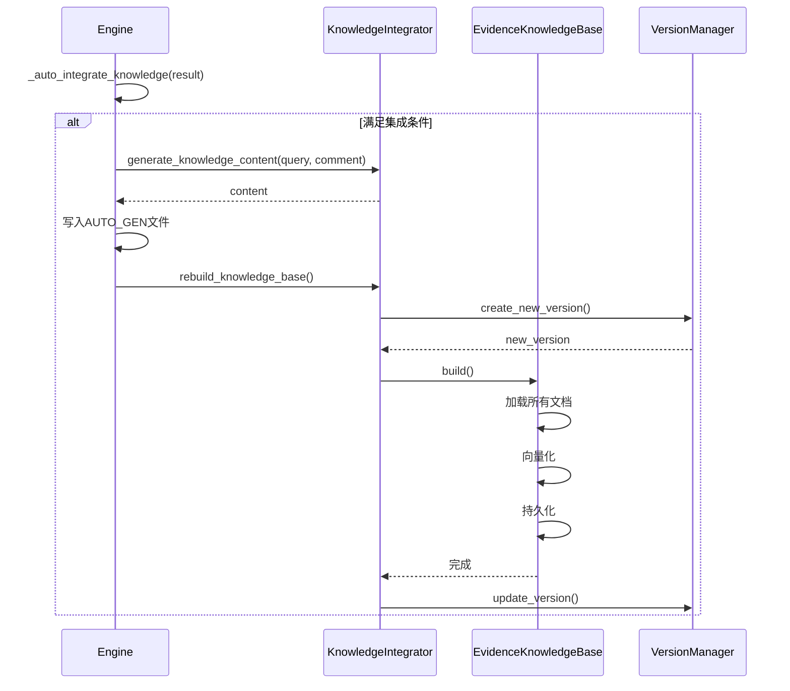
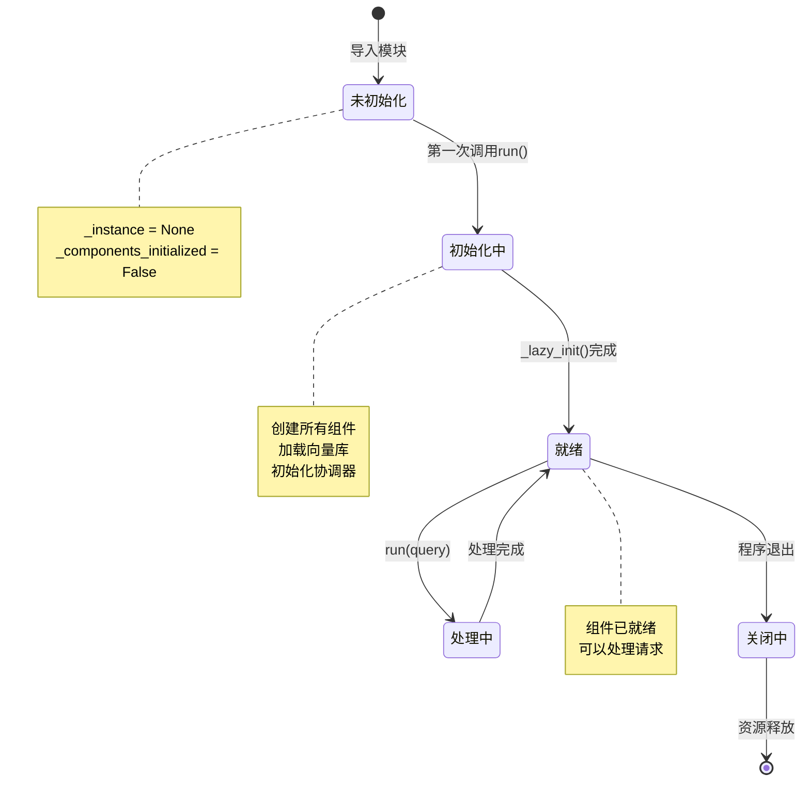
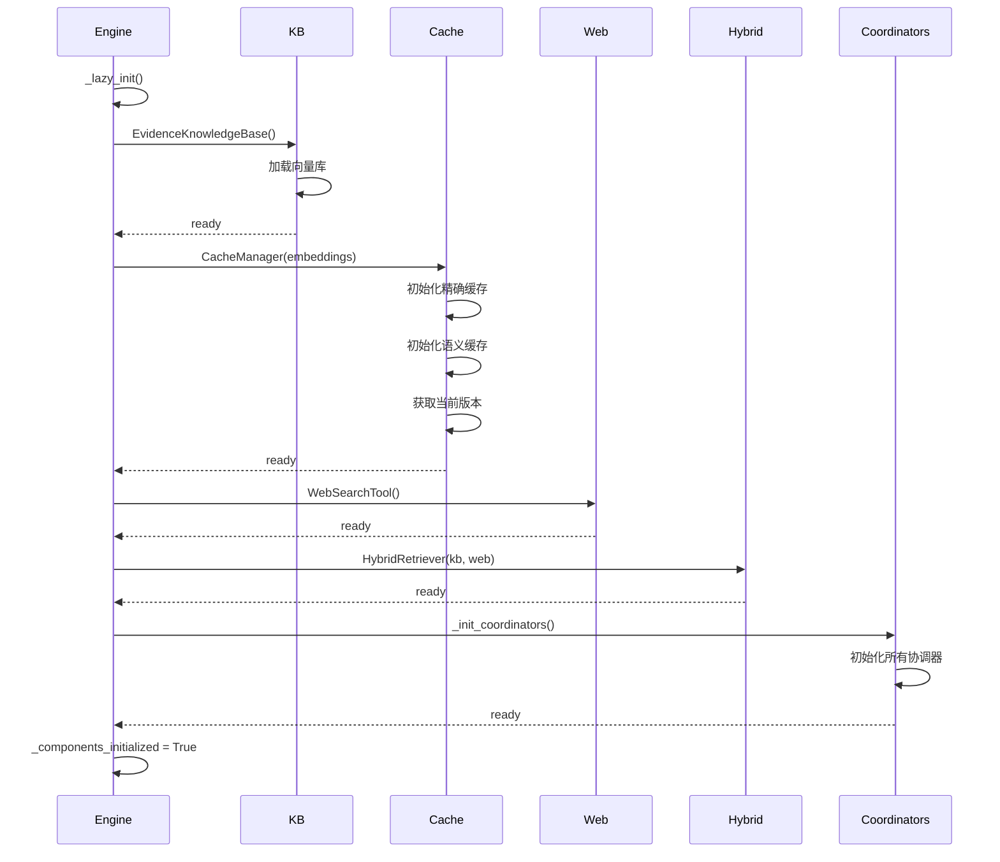
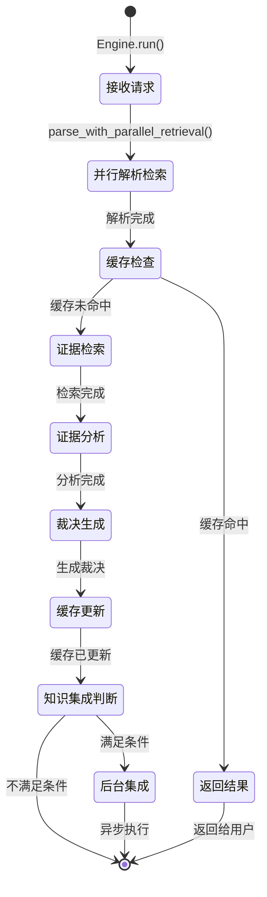

# 模块关系与依赖图

> 本文档详细说明项目各模块之间的依赖关系和交互方式
>
> 生成时间: 2026-02-09

---

## 目录

1. [模块依赖层次](#1-模块依赖层次)
2. [核心模块详解](#2-核心模块详解)
3. [依赖关系矩阵](#3-依赖关系矩阵)
4. [数据流图](#4-数据流图)
5. [生命周期图](#5-生命周期图)

---

## 1. 模块依赖层次



**依赖层次说明：**

| 层次 | 名称 | 职责 | 典型模块 |
|------|------|------|----------|
| 0 | 基础设施 | 配置、工具 | config, thread_utils |
| 1 | 核心基础设施 | 版本、并行度、缓存 | version_manager, parallelism_config |
| 2 | 可观测性 | 日志、监控、指标 | logger_config, api_monitor |
| 3 | 工具层 | LLM工厂、批量处理 | llm_factory, batch_embedder |
| 4 | 检索层 | 向量检索、联网搜索 | evidence_retriever, hybrid_retriever |
| 5 | 分析层 | 查询解析、证据分析 | query_parser, evidence_analyzer |
| 6 | 协调层 | 协调各层工作 | query_processor, retrieval_coordinator |
| 7 | 知识管理层 | 知识集成、自我进化 | knowledge_integrator |
| 8 | 引擎层 | 总编排 | pipeline |
| 9 | 服务层 | 对外接口 | api_service, web_interface |

---

## 2. 核心模块详解

### 2.1 引擎层 (pipeline.py)

**职责：**
- 总编排所有协调器
- 管理组件生命周期
- 统一错误处理

**依赖：**
```python
# 核心依赖
from src.core.coordinators import (
    QueryProcessor,
    RetrievalCoordinator,
    AnalysisCoordinator,
    VerdictGenerator
)
from src.core.cache_manager import CacheManager
from src.core.thread_utils import get_lock_manager

# 检索层
from src.retrievers.hybrid_retriever import HybridRetriever

# 知识层
from src.knowledge.knowledge_integrator import KnowledgeIntegrator

# 数据模型
from src.analyzers.query_parser import QueryAnalysis
from src.analyzers.truth_summarizer import FinalVerdict
```

**被依赖：**
- `src.services.api_service`
- `src.services.web_interface`
- `scripts/main.py`
- `tests/`

### 2.2 协调器层

#### QueryProcessor

**职责：**
- 查询解析
- 缓存检查
- 并行检索调度

**依赖：**
```python
from src.analyzers.query_parser import build_chain
from src.core.cache_manager import CacheManager
from src.retrievers.hybrid_retriever import HybridRetriever
from src.core.parallelism_config import get_parallelism_config
```

**被依赖：**
- `src.core.pipeline`

#### RetrievalCoordinator

**职责：**
- 混合检索协调
- 证据去重
- 格式转换

**依赖：**
```python
from src.retrievers.hybrid_retriever import HybridRetriever
from src.retrievers.evidence_retriever import EvidenceKnowledgeBase
```

**被依赖：**
- `src.core.pipeline`

#### AnalysisCoordinator

**职责：**
- 分析调度
- 并行控制

**依赖：**
```python
from src.analyzers.evidence_analyzer import EvidenceAnalyzer
```

**被依赖：**
- `src.core.pipeline`

#### VerdictGenerator

**职责：**
- 裁决生成
- 置信度计算

**依赖：**
```python
from src.analyzers.truth_summarizer import summarize_truth
```

**被依赖：**
- `src.core.pipeline`

### 2.3 检索层

#### EvidenceKnowledgeBase

**职责：**
- 向量库管理
- 相似度检索
- 增量构建

**依赖：**
```python
from src import config
from src.utils.batch_embedder import get_batch_embedder
from src.utils.path_utils import setup_project_path
```

**被依赖：**
- `src.retrievers.hybrid_retriever`
- `src.core.coordinators.retrieval_coordinator`
- `src.core.pipeline`

#### HybridRetriever

**职责：**
- 混合检索策略
- 智能去重
- 联网决策

**依赖：**
```python
from src.retrievers.evidence_retriever import EvidenceKnowledgeBase
from src.retrievers.web_search_tool import WebSearchTool
from src import config
from src.utils.batch_embedder import get_batch_embedder
```

**被依赖：**
- `src.core.coordinators.query_processor`
- `src.core.coordinators.retrieval_coordinator`
- `src.core.pipeline`

#### WebSearchTool

**职责：**
- 联网搜索
- 结果格式化

**依赖：**
```python
from src import config
from langchain_community.tools.tavily_search import TavilySearchResults
```

**被依赖：**
- `src.retrievers.hybrid_retriever`

### 2.4 分析层

#### QueryParser

**职责：**
- 意图解析
- 实体提取
- 主张识别

**依赖：**
```python
from src import config
from src.utils.llm_factory import create_parser_llm
from langchain_core.prompts import ChatPromptTemplate
```

**被依赖：**
- `src.core.coordinators.query_processor`
- `src.core.pipeline`

#### EvidenceAnalyzer

**职责：**
- 多角度证据分析
- 并行分析调度
- 预过滤

**依赖：**
```python
from src import config
from src.utils.llm_factory import create_analyzer_llm
from src.core.parallelism_config import get_parallelism_config
from src.core.retry_policy import with_llm_retry
```

**被依赖：**
- `src.core.coordinators.analysis_coordinator`

#### TruthSummarizer

**职责：**
- 综合证据
- 生成裁决
- 计算置信度

**依赖：**
```python
from src import config
from src.utils.llm_factory import create_summarizer_llm
```

**被依赖：**
- `src.core.coordinators.verdict_generator`
- `src.core.pipeline`

### 2.5 基础设施层

#### CacheManager

**职责：**
- 精确缓存
- 语义缓存
- 版本感知失效

**依赖：**
```python
from src import config
from src.core.version_manager import VersionManager
from diskcache import Cache
from langchain_chroma import Chroma
```

**被依赖：**
- `src.core.coordinators.query_processor`
- `src.core.pipeline`

#### VersionManager

**职责：**
- 版本记录
- 版本查询
- 增量更新

**依赖：**
```python
from pathlib import Path
from pydantic import BaseModel
```

**被依赖：**
- `src.core.cache_manager`

#### ParallelismConfig

**职责：**
- 动态并行度计算
- 任务类型适配

**依赖：**
```python
import os
from pathlib import Path
```

**被依赖：**
- `src.core.coordinators.query_processor`
- `src.analyzers.evidence_analyzer`

---

## 3. 依赖关系矩阵

### 3.1 模块导入依赖

| 模块 | 被以下模块导入 | 导入以下模块 | 循环依赖 |
|------|--------------|-------------|---------|
| `config.py` | 几乎所有模块 | 无 | ❌ |
| `pipeline.py` | services, scripts | coordinators, retrievers, analyzers, cache | ❌ |
| `cache_manager.py` | pipeline, query_processor | version_manager, config | ❌ |
| `version_manager.py` | cache_manager | config | ❌ |
| `parallelism_config.py` | query_processor, evidence_analyzer | config | ❌ |
| `hybrid_retriever.py` | query_processor, retrieval_coordinator, pipeline | evidence_retriever, web_search_tool, config | ❌ |
| `evidence_retriever.py` | hybrid_retriever, retrieval_coordinator, pipeline | config, batch_embedder | ❌ |
| `web_search_tool.py` | hybrid_retriever | config | ❌ |
| `query_parser.py` | query_processor, pipeline | config, llm_factory | ❌ |
| `evidence_analyzer.py` | analysis_coordinator | config, llm_factory, parallelism_config | ❌ |
| `truth_summarizer.py` | verdict_generator, pipeline | config, llm_factory | ❌ |
| `query_processor.py` | pipeline | query_parser, cache_manager, hybrid_retriever, parallelism_config | ❌ |
| `retrieval_coordinator.py` | pipeline | hybrid_retriever, evidence_retriever | ❌ |
| `analysis_coordinator.py` | pipeline | evidence_analyzer | ❌ |
| `verdict_generator.py` | pipeline | truth_summarizer | ❌ |
| `knowledge_integrator.py` | pipeline | evidence_retriever, config | ❌ |
| `llm_factory.py` | query_parser, evidence_analyzer, truth_summarizer | config | ❌ |

**结论：** ✅ 无循环依赖

### 3.2 功能依赖关系



---

## 4. 数据流图

### 4.1 查询数据流



### 4.2 缓存数据流



### 4.3 知识集成数据流



---

## 5. 生命周期图

### 5.1 引擎生命周期



### 5.2 组件初始化顺序



### 5.3 请求处理生命周期



---

## 附录

### A. 模块文件路径映射

| 模块名 | 文件路径 |
|--------|---------|
| RumorJudgeEngine | src/core/pipeline.py |
| QueryProcessor | src/core/coordinators/query_processor.py |
| RetrievalCoordinator | src/core/coordinators/retrieval_coordinator.py |
| AnalysisCoordinator | src/core/coordinators/analysis_coordinator.py |
| VerdictGenerator | src/core/coordinators/verdict_generator.py |
| CacheManager | src/core/cache_manager.py |
| VersionManager | src/core/version_manager.py |
| ParallelismConfig | src/core/parallelism_config.py |
| EvidenceKnowledgeBase | src/retrievers/evidence_retriever.py |
| HybridRetriever | src/retrievers/hybrid_retriever.py |
| WebSearchTool | src/retrievers/web_search_tool.py |
| QueryParser | src/analyzers/query_parser.py |
| EvidenceAnalyzer | src/analyzers/evidence_analyzer.py |
| TruthSummarizer | src/analyzers/truth_summarizer.py |
| KnowledgeIntegrator | src/knowledge/knowledge_integrator.py |
| APIMonitor | src/observability/api_monitor.py |

### B. 接口定义

#### UnifiedVerificationResult

```python
class UnifiedVerificationResult(BaseModel):
    query: str                          # 原始查询
    is_cached: bool                     # 是否来自缓存
    is_fallback: bool                   # 是否兜底
    is_web_search: bool                 # 是否联网
    saved_to_cache: bool                # 是否保存到缓存

    # 解析结果
    entity: Optional[str]               # 实体
    claim: Optional[str]                # 主张
    category: Optional[str]             # 分类

    # 检索结果
    retrieved_evidence: List[Dict]      # 证据列表

    # 分析结果
    evidence_assessments: List[Any]     # 证据评估

    # 裁决结果
    final_verdict: Optional[str]        # 最终裁决
    confidence_score: int               # 置信度
    risk_level: Optional[str]           # 风险等级
    summary_report: Optional[str]       # 摘要报告

    # 元数据
    metadata: List[ProcessingMetadata]  # 处理元数据
```

#### FinalVerdict

```python
class FinalVerdict(BaseModel):
    verdict: VerdictType         # 裁决类型（真/假/争议/不足）
    confidence: int              # 置信度（0-100）
    risk_level: str              # 风险等级（低/中/高）
    summary: str                 # 摘要报告
    reasoning: Optional[str]     # 推理过程
```

---

**文档版本**: v1.0
**最后更新**: 2026-02-09
