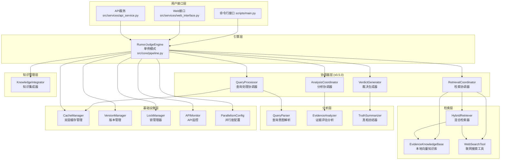
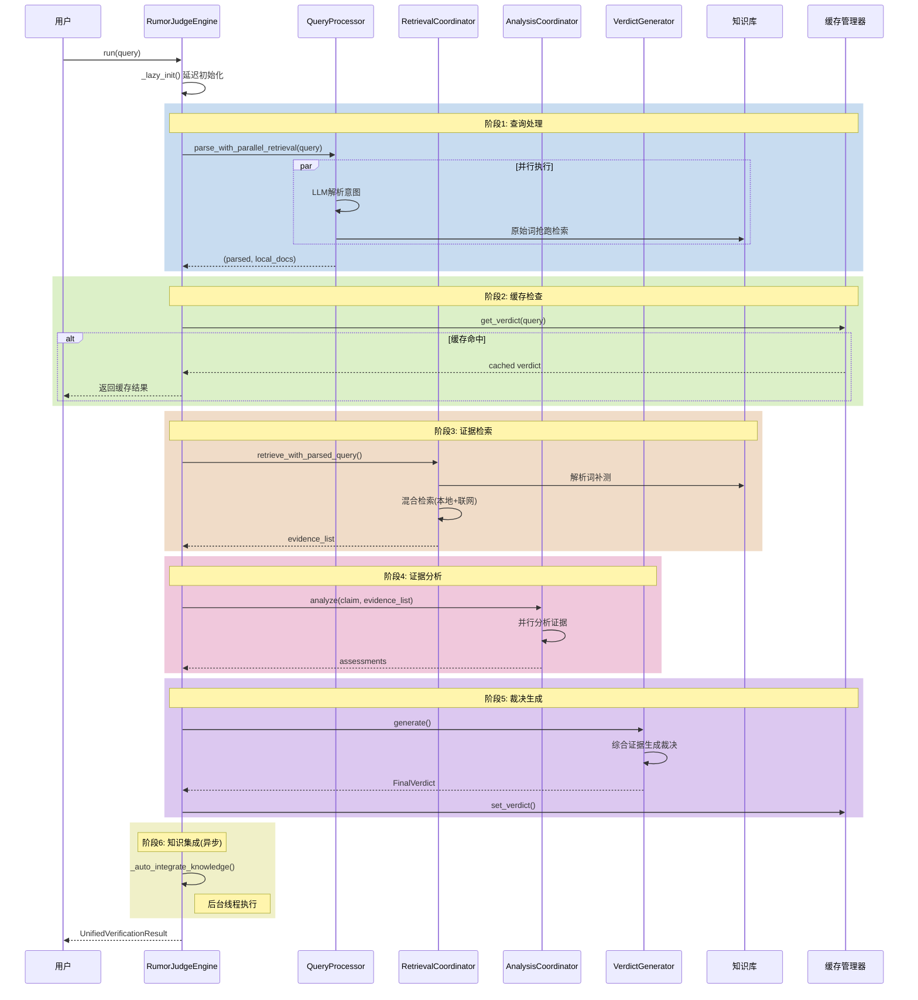
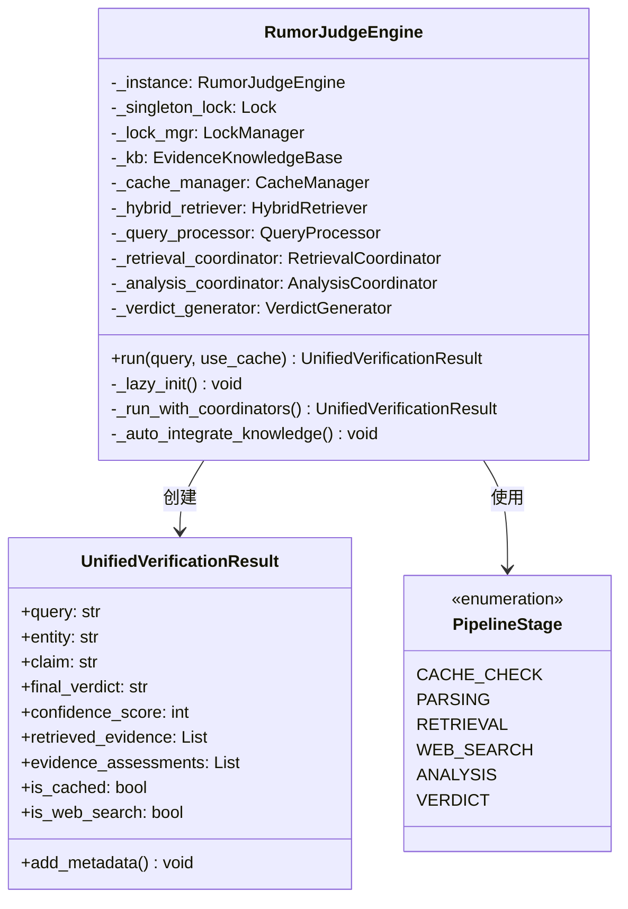
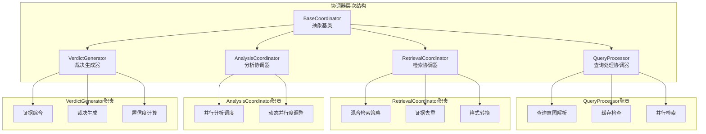
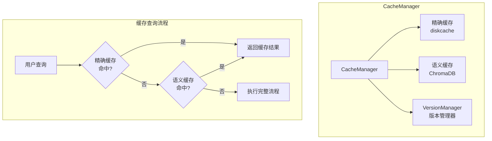
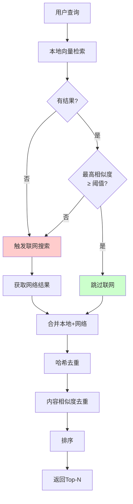
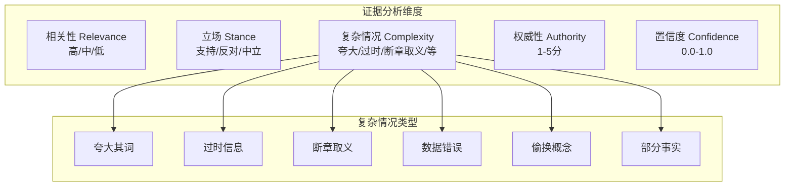
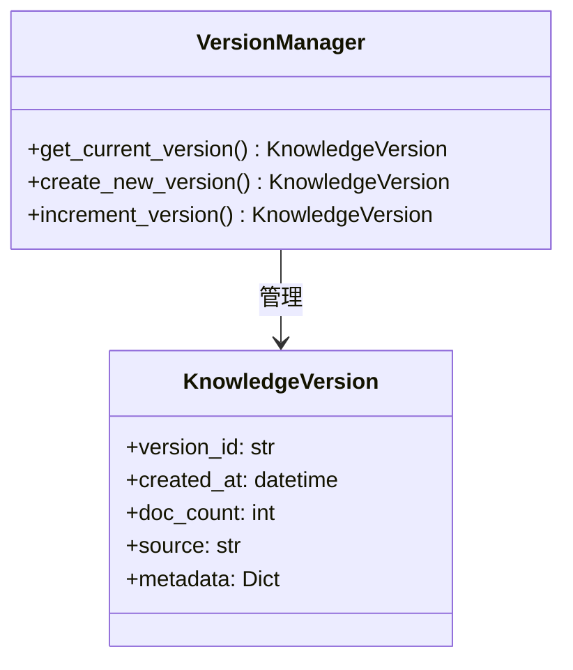
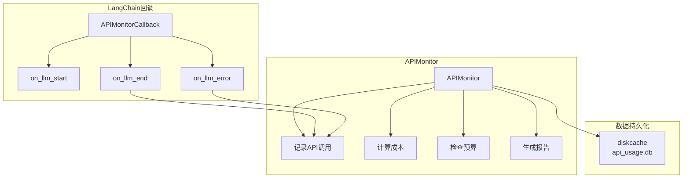
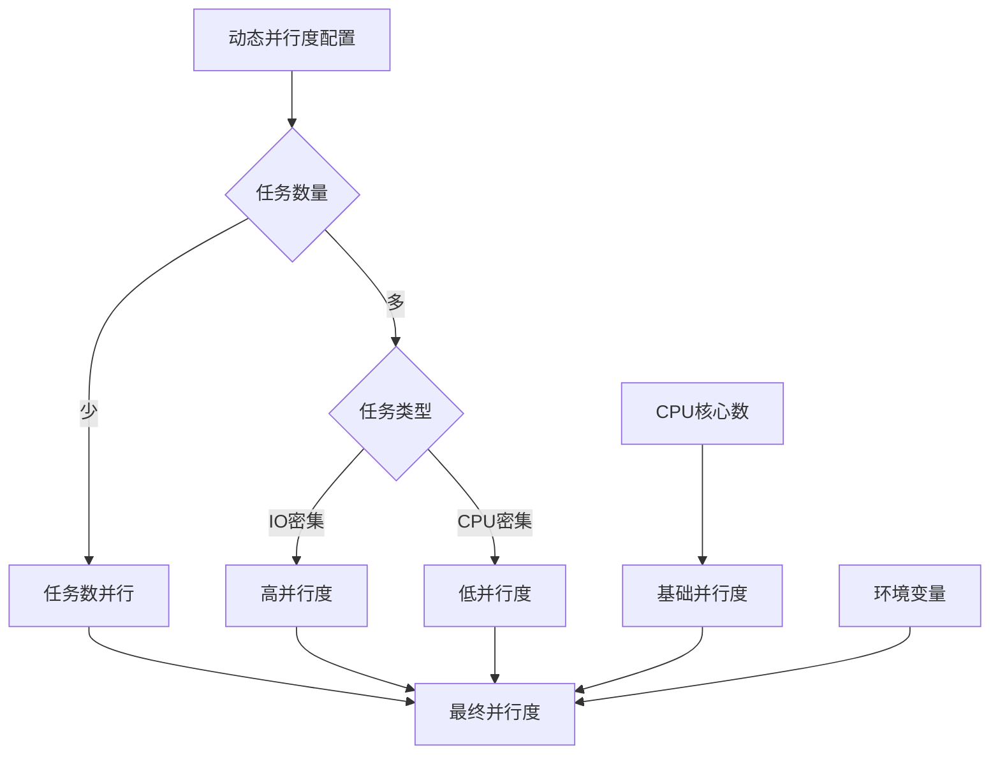

# 互联网谣言粉碎机 - 项目学习指南

> 基于RAG和LLM的智能谣言核查系统学习文档
>
> 生成时间: 2026-02-09
> 项目版本: v0.7.0

---

## 目录

- [第一部分：项目概览](#第一部分项目概览)
  - [1.1 项目简介](#11-项目简介)
  - [1.2 整体架构](#12-整体架构)
  - [1.3 主要工作流程](#13-主要工作流程)
  - [1.4 技术栈](#14-技术栈)
- [第二部分：核心模块详解](#第二部分核心模块详解)
  - [2.1 引擎层 - RumorJudgeEngine](#21-引擎层---rumorjudgeengine)
  - [2.2 协调器模式](#22-协调器模式)
  - [2.3 缓存管理系统](#23-缓存管理系统)
  - [2.4 混合检索系统](#24-混合检索系统)
  - [2.5 证据分析系统](#25-证据分析系统)
- [第三部分：基础设施](#第三部分基础设施)
  - [3.1 线程安全机制](#31-线程安全机制)
  - [3.2 版本管理系统](#32-版本管理系统)
  - [3.3 API监控系统](#33-api监控系统)
  - [3.4 动态并行度配置](#34-动态并行度配置)
- [第四部分：设计模式与最佳实践](#第四部分设计模式与最佳实践)
- [第五部分：开发指南](#第五部分开发指南)

---

## 第一部分：项目概览

### 1.1 项目简介

**项目目标：** 构建一个智能的互联网谣言核查系统，能够自动分析用户输入的可疑信息，通过检索权威证据并进行多角度分析，给出可信的真伪裁决。

**核心特性：**

- 🔍 **智能核查**：基于RAG的语义检索，准确评估谣言真伪
- 🌐 **实时搜索**：集成互联网搜索，获取最新信息
- 🧠 **多模型协作**：解析、分析、裁决使用不同LLM模型
- ⚡ **高性能**：并行处理、动态并行度调整、语义缓存
- 📊 **API监控**：实时追踪API使用和成本
- 🔄 **自我进化**：自动将高置信度结果转化为本地知识
- 🛡️ **线程安全**：完整的并发安全保护

### 1.2 整体架构



### 1.3 主要工作流程



**流程说明：**

1. **查询处理阶段**：并行执行LLM意图解析和本地向量检索（抢跑策略）
2. **缓存检查阶段**：精确匹配 + 语义相似度匹配，版本感知失效
3. **证据检索阶段**：混合检索策略，本地质量不足时自动联网
4. **证据分析阶段**：多角度并行分析，动态调整并行度
5. **裁决生成阶段**：综合所有证据给出最终裁决
6. **知识集成阶段**：后台异步将高置信度结果转化为本地知识

### 1.4 技术栈

| 类别 | 技术组件 | 用途 |
|------|---------|------|
| **核心框架** | Python 3.11+ | 主要编程语言 |
| **LLM框架** | LangChain 0.3+ | LLM应用开发框架 |
| **向量数据库** | ChromaDB | 本地向量知识库存储 |
| **嵌入模型** | text-embedding-v4 (DashScope) | 文本向量化 |
| **LLM模型** | qwen-max, qwen-plus (通义千问) | 意图解析、证据分析、裁决生成 |
| **联网搜索** | Tavily API | 互联网搜索 |
| **缓存** | diskcache | 磁盘持久化缓存 |
| **并发** | concurrent.futures | 并行处理 |
| **日志** | structlog | 结构化日志 |

---

## 第二部分：核心模块详解

### 2.1 引擎层 - RumorJudgeEngine

**文件位置：** `src/core/pipeline.py`

#### 背景与目标

**为什么需要引擎层？**
- 谣言核查是一个复杂的多阶段流程，需要一个统一的编排者
- 各个功能模块（解析、检索、分析、裁决）需要协调工作
- 需要统一的生命周期管理和错误处理机制

**解决了什么问题？**
- **复杂流程编排**：将6个阶段的处理流程统一管理
- **组件生命周期**：延迟初始化，按需加载资源
- **统一错误处理**：标准化错误响应和元数据记录
- **线程安全**：单例模式 + 细粒度锁，支持多线程并发

#### 架构设计



#### 关键实现

**1. 线程安全的单例模式**

```python
class RumorJudgeEngine:
    _instance = None
    _singleton_lock = threading.Lock()  # 单例创建专用锁

    def __new__(cls):
        """实现单例模式，确保全局只有一个引擎实例"""
        with cls._singleton_lock:
            if cls._instance is None:
                cls._instance = super(RumorJudgeEngine, cls).__new__(cls)
                cls._instance._initialized = False
            return cls._instance
```

**设计理由：**
- **为什么用单例？** 引擎初始化成本高（加载向量库、初始化LLM），全局共享一个实例最经济
- **为什么用独立锁？** 单例创建锁与组件初始化锁分离，避免死锁
- **双重检查模式：** `__new__` 中检查，`__init__` 中再检查，确保线程安全

**2. 延迟初始化（Lazy Initialization）**

```python
def _lazy_init(self):
    """延迟初始化核心组件，确保在真正需要时才加载资源"""
    if self._components_initialized:
        return

    with self._lock_mgr.acquire("component_init", timeout=30):
        # 双重检查
        if self._components_initialized:
            return

        # 初始化所有核心组件
        self._kb = EvidenceKnowledgeBase()
        self._cache_manager = CacheManager(embeddings=self._kb.embeddings)
        # ...
        self._components_initialized = True
```

**设计理由：**
- **为什么延迟初始化？** 避免导入时立即加载重型资源（向量库、LLM），提高启动速度
- **为什么用双重检查？** 并发场景下，第一个线程初始化完成后，后续线程无需等待
- **为什么用LockManager？** 统一管理所有锁，支持超时机制，避免死锁

**3. 自动知识沉淀**

```python
def _auto_integrate_knowledge(self, result: UnifiedVerificationResult):
    """
    自动知识沉淀：如果通过联网搜索获得了高置信度的结论，
    将其异步转化为本地知识。
    """
    min_confidence = getattr(config, 'AUTO_INTEGRATE_MIN_CONFIDENCE', 90)
    min_evidence = getattr(config, 'AUTO_INTEGRATE_MIN_EVIDENCE', 3)

    # 严格准入门槛
    if result.final_verdict not in ["真", "假"]:
        return
    if result.confidence_score < min_confidence:
        return
    if len(result.retrieved_evidence) < min_evidence:
        return

    # 后台异步集成
    def background_integration():
        with self._lock_mgr.acquire("knowledge_integration", timeout=1.0):
            # 生成知识文件并增量更新向量库
            self.knowledge_integrator.rebuild_knowledge_base()

    thread = threading.Thread(target=background_integration)
    thread.daemon = True
    thread.start()
```

**设计理由：**
- **为什么严格门槛？** 避免低质量信息污染本地知识库
- **为什么异步执行？** 不阻塞用户查询，提升响应速度
- **为什么用daemon线程？** 主程序退出时自动结束，避免僵尸进程

#### 技术难点与解决方案

| 难点 | 解决方案 |
|------|---------|
| **死锁风险** | 使用LockManager统一管理锁，每个锁有名称和超时 |
| **组件初始化顺序** | 延迟初始化，按需加载，避免循环依赖 |
| **并发安全** | 细粒度锁 + 上下文管理器，自动释放锁 |
| **资源泄漏** | daemon线程 + 上下文管理器，确保资源释放 |

---

### 2.2 协调器模式

**文件位置：** `src/core/coordinators/`

#### 背景与目标

**为什么引入协调器模式？**

在v0.5.0之前，`RumorJudgeEngine`承担了太多职责：
- 查询解析逻辑耦合在引擎中
- 检索策略判断逻辑散落各处
- 证据分析并行逻辑复杂

**协调器模式解决的核心问题：**

1. **关注点分离**：每个协调器专注于一个领域
2. **代码复用**：协调器可独立测试和复用
3. **易于扩展**：新增功能只需修改对应协调器

#### 协调器架构



#### 2.2.1 QueryProcessor - 查询处理协调器

**文件：** `src/core/coordinators/query_processor.py`

**职责：**
1. 解析用户查询（实体、主张、分类）
2. 检查缓存
3. **并行执行解析和本地检索**（v0.5.1新增）

**核心方法：`parse_with_parallel_retrieval`**

```python
def parse_with_parallel_retrieval(self, query: str) -> Tuple[Optional[QueryAnalysis], list]:
    """
    并行执行查询解析和本地检索（抢跑策略）

    为什么并行？
    - LLM解析需要几百毫秒
    - 本地检索也需要几百毫秒
    - 两者独立，可以并行执行
    - 检索结果可以复用，避免后续重复检索
    """
    if PARALLELISM_CONFIG_AVAILABLE:
        max_workers = get_parallelism_config().get_adaptive_workers(
            task_count=2,
            task_type='retrieval',
            min_workers=2
        )
    else:
        max_workers = 2

    with concurrent.futures.ThreadPoolExecutor(max_workers=max_workers) as executor:
        # 任务1: LLM解析意图
        parse_future = executor.submit(self.parser_chain.invoke, {"query": query})

        # 任务2: 原始词直接去本地库查一把（抢跑）
        raw_search_future = executor.submit(self.hybrid_retriever.search_local, query)

        # 等待解析完成
        analysis = parse_future.result()
        local_docs = raw_search_future.result()

        return analysis, local_docs
```

**设计理由：**

1. **为什么抢跑？**
   - LLM解析可能改变查询词（如"维生素C防感冒"→"entity:维生素C, claim:预防感冒"）
   - 但原词的检索结果可能仍有价值
   - 提前检索可以节省后续时间

2. **为什么用动态并行度？**
   - 2个任务不需要太多线程
   - 但仍使用配置系统保持一致性
   - `min_workers=2` 确保至少2个线程

#### 2.2.2 RetrievalCoordinator - 检索协调器

**文件：** `src/core/coordinators/retrieval_coordinator.py`

**职责：**
1. 协调本地检索和网络搜索
2. 实现混合检索策略
3. 证据去重和排序
4. 格式转换（Document → Dict）

**核心方法：`retrieve_with_parsed_query`**

```python
def retrieve_with_parsed_query(
    self,
    query: str,
    parsed_info: Any,
    local_docs: List = None
) -> List[Dict[str, Any]]:
    """
    使用解析后的查询进行检索（v0.5.1 增强）

    流程：
    1. 如果解析词≠原始词，用解析词补测本地库
    2. 汇总所有本地结果并去重
    3. 调用混合检索（传入已有本地文档）
    4. 混合检索决定是否触发联网搜索
    """
    # 构造解析词
    parsed_query = f"{parsed_info.entity} {parsed_info.claim}"

    # 解析词补测本地库
    if parsed_query and parsed_query != query:
        local_docs.extend(self.hybrid_retriever.search_local(parsed_query))

    # 去重
    unique_local_docs = self._deduplicate_docs(local_docs)

    # 混合检索（会决定是否联网）
    documents = self.hybrid_retriever.search_hybrid(
        search_query,
        existing_local_docs=unique_local_docs
    )

    return self._convert_to_dict_format(documents)
```

**设计理由：**

1. **为什么解析词补测？**
   - LLM解析后的查询词可能更准确
   - 例：原词"喝隔夜水会致癌吗？"→解析词"隔夜水 致癌"
   - 解析词可能检索到更相关的结果

2. **为什么传入已有本地文档？**
   - 避免混合检索器重复检索本地库
   - 混合检索器可以基于已有结果判断是否需要联网

#### 2.2.3 AnalysisCoordinator - 分析协调器

**文件：** `src/core/coordinators/analysis_coordinator.py`

**职责：**
1. 调度证据分析任务
2. 动态调整并行度
3. 汇总分析结果

**核心简化实现：**

```python
class AnalysisCoordinator(BaseCoordinator):
    """分析协调器 - 简化版委托给EvidenceAnalyzer"""

    def analyze(self, claim: str, evidence_list: List[Dict]) -> List[Any]:
        """
        执行证据分析（委托给EvidenceAnalyzer）

        为什么需要协调器？
        - 未来可以在这里添加更多逻辑
        - 例如：动态并行度调整、结果缓存、错误重试等
        - 目前是简单委托，保持架构一致性
        """
        from src.analyzers.evidence_analyzer import EvidenceAnalyzer

        analyzer = EvidenceAnalyzer()
        return analyzer.analyze(claim, evidence_list)
```

**设计理由：**

- **为什么看起来这么简单？**
  - 协调器模式预留了扩展空间
  - 未来可以在这里添加更多逻辑（如动态并行度、结果缓存）
  - 目前简单委托，保持架构一致性

#### 2.2.4 VerdictGenerator - 裁决生成器

**文件：** `src/core/coordinators/verdict_generator.py`

**职责：**
1. 综合所有证据和分析结果
2. 生成最终裁决
3. 计算置信度和风险等级

**核心方法：**

```python
def generate(
    self,
    query: str,
    entity: str,
    claim: str,
    evidence_list: List[Dict],
    assessments: List[Any]
) -> FinalVerdict:
    """
    生成最终裁决

    流程：
    1. 整理证据和分析结果
    2. 调用TruthSummarizer生成裁决
    3. 返回FinalVerdict对象
    """
    from src.analyzers.truth_summarizer import summarize_truth

    verdict = summarize_truth(
        query=query,
        entity=entity,
        claim=claim,
        evidence_list=evidence_list,
        assessments=assessments
    )

    return verdict
```

**设计理由：**

- **为什么独立成协调器？**
  - 裁决生成是一个复杂的逻辑
  - 未来可以支持多种裁决策略（投票、加权、机器学习）
  - 与引擎解耦，便于测试

---

### 2.3 缓存管理系统

**文件位置：** `src/core/cache_manager.py`

#### 背景与目标

**为什么需要双层缓存？**

1. **精确匹配缓存**：基于MD5哈希，毫秒级响应
2. **语义相似度缓存**：基于向量相似度，捕获相似查询

**解决了什么问题？**

- **性能优化**：避免重复的LLM调用和向量检索
- **成本降低**：减少API调用次数
- **版本感知**：知识库更新后自动失效缓存

#### 架构设计



#### 核心实现

**1. 双层缓存查询**

```python
def get_verdict(self, query: str) -> Optional[FinalVerdict]:
    """
    尝试获取缓存的裁决结果（支持精确匹配和语义匹配）

    新增：检查知识库版本一致性，如果版本不匹配则缓存失效
    """
    # 检查知识库版本是否变化
    if self._is_version_changed():
        logger.info("知识库版本已变化，缓存已失效")
        return None

    # 1. 首先尝试精确匹配（极速）
    key = self._generate_key(query)
    data = self.cache.get(key)
    if data:
        if self._is_cache_version_valid(data):
            logger.info(f"精确命中缓存: '{query}'")
            return self._to_verdict(data)
        else:
            # 删除过期缓存
            self.cache.delete(key)

    # 2. 尝试语义匹配（如果配置了 embeddings）
    if self.vector_cache:
        results = self.vector_cache.similarity_search_with_score(query, k=1)
        if results:
            doc, distance = results[0]
            similarity = 1.0 - distance
            if similarity >= self.semantic_threshold:
                cached_query = doc.page_content
                semantic_key = doc.metadata.get("cache_key")
                logger.info(f"语义命中缓存: '{query}' -> '{cached_query}' (相似度: {similarity:.4f})")

                semantic_data = self.cache.get(semantic_key)
                if semantic_data and self._is_cache_version_valid(semantic_data):
                    # 为了加速下次匹配，将当前查询也存入精确缓存
                    self.cache.set(key, semantic_data, expire=self.default_ttl)
                    return self._to_verdict(semantic_data)

    return None
```

**设计理由：**

1. **为什么先精确匹配？**
   - 精确匹配O(1)复杂度，最快
   - 语义匹配需要向量检索，较慢
   - 大多数重复查询是精确重复

2. **为什么语义命中后更新精确缓存？**
   - 下次相同查询直接命中精确缓存
   - 自动"学习"用户查询模式

3. **为什么需要版本感知？**
   - 知识库更新后，旧缓存可能过时
   - 版本不匹配时自动失效

**2. 版本感知缓存失效**

```python
def _is_version_changed(self) -> bool:
    """
    检查知识库版本是否变化（线程安全）

    边界情况处理：
    - 首次构建：None -> 有版本，视为变化
    - 版本更新：旧版本 -> 新版本，视为变化
    - 无版本文件：视为无变化（使用 TTL 机制）
    """
    with self._version_lock:
        current_version = self._version_manager.get_current_version()

        old_version_id = self._current_kb_version.version_id if self._current_kb_version else None
        new_version_id = current_version.version_id if current_version else None

        if old_version_id != new_version_id:
            # 更新当前版本
            self._current_kb_version = current_version
            return True

        return False

def _is_cache_version_valid(self, cached_data: dict) -> bool:
    """
    检查缓存条目的版本是否有效

    边界情况处理：
    - 缓存无版本号 + 当前无版本：有效（首次构建前）
    - 缓存无版本号 + 当前有版本：无效（首次构建后的旧缓存）
    - 缓存有版本号 + 版本不匹配：无效
    - 缓存有版本号 + 版本匹配：有效
    """
    current_version = self._version_manager.get_current_version()
    current_version_id = current_version.version_id if current_version else None

    if "kb_version" not in cached_data:
        if current_version_id:
            return False  # 旧版本缓存
        return True  # 首次构建前

    cached_version = cached_data.get("kb_version")
    if cached_version != current_version_id:
        return False

    return True
```

**设计理由：**

1. **为什么区分首次构建前后？**
   - 首次构建前没有版本号，旧缓存应该保留
   - 首次构建后有版本号，旧缓存应该失效

2. **为什么用锁保护？**
   - 版本检查可能并发执行
   - 避免脏读和不一致

#### 技术难点

| 难点 | 解决方案 |
|------|---------|
| **版本同步** | 版本管理器 + 缓存条目标记 |
| **边界情况** | 区分首次构建前后，正确处理None |
| **并发安全** | 细粒度锁 + 双重检查 |

---

### 2.4 混合检索系统

**文件位置：** `src/retrievers/hybrid_retriever.py`

#### 背景与目标

**为什么需要混合检索？**

1. **本地检索快但知识有限**：向量库只包含预存的知识
2. **网络搜索慢但知识无限**：互联网有最新信息
3. **需要智能决策**：何时联网、何时本地

**解决了什么问题？**

- **知识覆盖不足**：本地没有时自动联网
- **检索质量低**：本地相似度低时自动联网
- **结果重复**：自动去重本地和网络结果

#### 架构设计



#### 核心实现

**1. 混合检索决策**

```python
def search_hybrid(self, query: str, existing_local_docs: List[Document] = None) -> List[Document]:
    """执行混合检索逻辑"""

    # 1. 如果没有传入现成的本地结果，则执行本地检索
    if existing_local_docs is None:
        all_docs = self.search_local(query)
    else:
        all_docs = existing_local_docs

    # 2. 计算最大相似度（对自动生成内容降权）
    max_similarity = 0.0
    if all_docs:
        weighted_similarities = []
        auto_gen_weight = getattr(config, 'AUTO_GEN_WEIGHT', 0.9)  # 默认0.9
        for d in all_docs:
            raw_sim = d.metadata['similarity']
            # 如果是自动生成的内容，应用加权系数
            if "AUTO_GEN_" in d.metadata['source']:
                raw_sim *= auto_gen_weight
            weighted_similarities.append(raw_sim)
        max_similarity = max(weighted_similarities)

    # 3. 判断是否需要联网搜索
    should_search_web = (
        len(all_docs) == 0 or
        max_similarity < self.min_local_similarity
    )

    if should_search_web:
        logger.info(f"触发联网搜索 (相似度: {max_similarity:.2f} < {self.min_local_similarity})")
        web_results = self.web_tool.search(query)
        # 转换为Document格式...
        all_docs.extend(web_docs)

    # 4. 去重与排序
    unique_docs = self._deduplicate_docs(all_docs)
    sorted_docs = sorted(unique_docs, key=sort_key, reverse=True)
    return sorted_docs[:self.max_results]
```

**设计理由：**

1. **为什么对自动生成内容降权？**
   - 自动生成内容（AUTO_GEN_*）是系统自我进化的产物
   - 可能不如人工核查的内容可靠
   - 降权避免其虚高阻断联网搜索

2. **为什么相似度阈值设为0.6？**
   - 太高（如0.8）：频繁触发联网，性能差
   - 太低（如0.3）：本地质量不足时仍不联网
   - 0.6是经验值，平衡性能和质量

**2. 智能去重**

```python
def _deduplicate_docs(self, docs: List[Document]) -> List[Document]:
    """
    智能去重：结合哈希和内容相似度判断

    策略：
    1. 使用完整内容的哈希进行精确去重
    2. 对剩余文档使用内容相似度进行模糊去重（> 0.85视为重复）
    """
    if not docs:
        return []

    # 第一阶段：精确哈希去重
    seen_hashes = set()
    hash_unique = []
    for doc in docs:
        content = doc.page_content[:500].strip()
        h = hash(content)
        if h not in seen_hashes:
            seen_hashes.add(h)
            hash_unique.append(doc)

    # 第二阶段：内容相似度模糊去重
    unique = []
    for doc in hash_unique:
        content_clean = ' '.join(doc.page_content.split())

        is_duplicate = False
        for seen_doc in unique:
            similarity = SequenceMatcher(
                None,
                content_clean[:300],
                ' '.join(seen_doc.page_content.split())[:300]
            ).ratio()

            if similarity > 0.85:
                logger.info(f"发现相似文档，已去重 (相似度: {similarity:.2f})")
                is_duplicate = True
                break

        if not is_duplicate:
            unique.append(doc)

    return unique
```

**设计理由：**

1. **为什么两阶段去重？**
   - 哈希去重快速但只能精确匹配
   - 相似度去重慢但能捕获近似重复
   - 先快后慢，性能最优

2. **为什么阈值0.85？**
   - 太高（0.95）：漏掉重复
   - 太低（0.7）：误杀不同文档
   - 0.85是经验值

#### 技术难点

| 难点 | 解决方案 |
|------|---------|
| **联网决策** | 相似度阈值 + 自动生成内容降权 |
| **结果去重 | 两阶段：哈希 + 相似度 |
| **排序策略 | 本地优先 + 相似度加权 |

---

### 2.5 证据分析系统

**文件位置：** `src/analyzers/evidence_analyzer.py`

#### 背景与目标

**为什么需要多角度分析？**

谣言核查不能简单地判断"真"或"假"，需要考虑：

1. **相关性**：证据是否真的讨论了这个主张？
2. **立场**：证据支持还是反对？
3. **复杂情况**：是否存在夸大、过时、断章取义？
4. **权威性**：来源是否可靠？
5. **置信度**：分析结果有多大把握？

**解决了什么问题？**

- **单一维度不足**：不仅判断真伪，还识别复杂情况
- **并行分析**：多证据时并行处理，提升性能
- **成本优化**：预过滤机制，减少LLM调用

#### 分析维度



#### 核心实现

**1. 并行分析策略**

```python
def analyze(self, claim: str, evidence_list: List[Dict], chunk_size: int = 2) -> List[EvidenceAssessment]:
    """
    执行分析，如果证据较多则采用并行处理以提高速度。

    策略：
    - 2-5个证据：单证据并行分析
    - >5个证据：分片并行分析
    - 预过滤：降低API成本
    """
    if not evidence_list:
        return []

    # 预过滤证据（降低LLM调用次数）
    evidence_list = self._prefilter_evidence(claim, evidence_list)

    count = len(evidence_list)

    # 优先使用单证据并行分析（适用于 2-5 个证据）
    if 2 <= count <= 5:
        logger.info(f"证据数量({count})适合单证据并行分析")
        return self._analyze_parallel_single(claim, evidence_list)

    if count <= chunk_size:
        # 数量较少，直接单次请求
        return self._analyze_batch(claim, evidence_list, offset=0)

    # 数量较多，分片并行分析
    chunks = [evidence_list[i:i + chunk_size] for i in range(0, count, chunk_size)]

    # 使用动态并行度配置
    if PARALLELISM_CONFIG_AVAILABLE:
        max_workers = get_parallelism_config().get_adaptive_workers(
            task_count=len(chunks),
            task_type='evidence_analyzer',
            min_workers=1
        )
    else:
        max_workers = min(len(chunks), 5)

    all_assessments = []
    with concurrent.futures.ThreadPoolExecutor(max_workers=max_workers) as executor:
        future_to_chunk = {
            executor.submit(self._analyze_batch, claim, chunk, i * chunk_size): i
            for i, chunk in enumerate(chunks)
        }

        for future in concurrent.futures.as_completed(future_to_chunk):
            try:
                batch_results = future.result()
                all_assessments.extend(batch_results)
            except Exception as e:
                logger.error(f"分片分析失败: {e}")

    all_assessments.sort(key=lambda x: x.id)
    return all_assessments
```

**设计理由：**

1. **为什么2-5个证据用单证据并行？**
   - 每个证据独立分析，粒度更细
   - 避免一个失败影响全部
   - 比分片并行更快（减少串行等待）

2. **为什么>5个证据用分片并行？**
   - 单证据并行会创建太多线程
   - 分片并行更经济
   - chunk_size=2是平衡点

**2. 预过滤机制**

```python
def _prefilter_evidence(self, claim: str, evidence_list: List[Dict]) -> List[Dict]:
    """
    预过滤证据，基于简单规则快速筛选

    规则：
    1. 过滤相似度过低的证据
    2. 限制最大证据数量
    3. 优先保留本地证据（权威性更高）
    """
    if not self.enable_prefilter:
        return evidence_list

    # 1. 过滤相似度过低的证据
    filtered = []
    for ev in evidence_list:
        similarity = ev.get('metadata', {}).get('similarity', 0.0)
        if similarity >= self.prefilter_min_similarity or similarity == 0.0:
            filtered.append(ev)

    # 2. 优先保留本地证据（权威性更高）
    local_evidence = [ev for ev in filtered if ev.get('metadata', {}).get('type') == 'local']
    web_evidence = [ev for ev in filtered if ev.get('metadata', {}).get('type') == 'web']

    # 3. 限制最大数量（本地证据优先）
    selected = local_evidence[:self.prefilter_max_evidence]
    remaining_slots = self.prefilter_max_evidence - len(selected)

    if remaining_slots > 0 and web_evidence:
        selected.extend(web_evidence[:remaining_slots])

    logger.info(f"预过滤完成: {len(evidence_list)} -> {len(selected)} 条证据")
    return selected
```

**设计理由：**

1. **为什么过滤低相似度证据？**
   - 相似度<0.3的证据基本无关
   - 分析它们浪费API调用
   - 用户也认为不相关

2. **为什么限制5条？**
   - 裁决生成不需要太多证据
   - 3-5条高质量证据足够
   - 减少API调用，降低成本

**3. Few-Shot提示工程**

```python
self.prompt = ChatPromptTemplate.from_messages([
    ("system", """你是一个专业的谣言核查分析师。

    **分析示例 (Few-Shot)**:

    *   **主张**: "吃香蕉会得癌症，因为香蕉有辐射。"
        **证据**: "香蕉确实含有微量放射性钾-40，但其剂量极低，对人体完全无害。" (来源: 科普中国)
        **分析**: 立场=反对, 标签=夸大其词/偷换概念, 理由=证据承认有辐射事实，但指出了剂量的安全性，主张抛开剂量谈毒性是夸大危害。, 引用="其剂量极低，对人体完全无害", 置信度=0.95

    *   **主张**: "某地刚刚发生特大爆炸，伤亡惨重！"
        **证据**: "网传视频实为2015年天津港爆炸视频，近期该地无相关警情。" (来源: 网警辟谣)
        **分析**: 立场=反对, 标签=过时信息, 理由=主张使用了旧视频来伪造新事件，属于旧闻新炒。, 引用="网传视频实为2015年天津港爆炸视频", 置信度=0.98
    """),
    ("human", "**谣言主张**：{claim}\n\n**待分析证据列表**：{evidence_text}")
])
```

**设计理由：**

- **为什么用Few-Shot？**
  - 提供具体示例，LLM理解更准确
  - 示例覆盖典型场景（夸大、过时）
  - 提高输出一致性

#### 技术难点

| 难点 | 解决方案 |
|------|---------|
| **并行策略** | 2-5单证据并行，>5分片并行 |
| **API成本** | 预过滤 + 限制数量 |
| **输出一致性** | Few-Shot提示工程 |

---

## 第三部分：基础设施

### 3.1 线程安全机制

**文件位置：** `src/core/thread_utils.py`

#### 背景与目标

**为什么需要线程安全？**

1. **单例模式**：多线程同时创建单例
2. **延迟初始化**：多线程同时初始化组件
3. **知识集成**：多线程同时更新向量库
4. **版本检查**：多线程同时检查版本

**解决了什么问题？**

- **竞态条件**：多线程同时修改共享状态
- **死锁**：多个锁相互等待
- **资源泄漏**：锁未正确释放

#### LockManager设计

```mermaid
graph TB
    subgraph "LockManager"
        A[LockManager]
        B[命名锁字典<br/>_locks: Dict[str, Lock]]
        C[获取锁<br/>acquire]
        D[释放锁<br/>release]
    end

    subgraph "锁命名空间"
        E["component_init<br/>组件初始化"]
        F["knowledge_integration<br/>知识集成"]
        G["version_check<br/>版本检查"]
    end

    A --> B
    A --> C
    A --> D

    C --> E
    C --> F
    C --> G
```

#### 核心实现

```python
class LockManager:
    """
    线程锁管理器

    功能：
    1. 为不同的资源创建独立的命名锁
    2. 支持超时机制，避免死锁
    3. 自动释放锁（上下文管理器）
    4. 锁复用，避免创建过多锁
    """

    def __init__(self):
        self._locks: Dict[str, threading.Lock] = {}
        self._meta_lock = threading.Lock()  # 保护锁字典本身的锁

    def acquire(self, name: str, timeout: float = None):
        """
        获取指定名称的锁（上下文管理器）

        Args:
            name: 锁名称
            timeout: 超时时间（秒）

        Returns:
            上下文管理器，支持 with 语句
        """
        # 获取或创建锁
        with self._meta_lock:
            if name not in self._locks:
                self._locks[name] = threading.RLock()
            lock = self._locks[name]

        return _LockContext(lock, name, timeout)

class _LockContext:
    """锁上下文管理器"""

    def __init__(self, lock: threading.RLock, name: str, timeout: float = None):
        self.lock = lock
        self.name = name
        self.timeout = timeout
        self.acquired = False

    def __enter__(self):
        if self.timeout:
            self.acquired = self.lock.acquire(blocking=True, timeout=self.timeout)
            if not self.acquired:
                raise TimeoutError(f"获取锁 '{self.name}' 超时")
        else:
            self.lock.acquire()
            self.acquired = True
        return self

    def __exit__(self, exc_type, exc_val, exc_tb):
        if self.acquired:
            self.lock.release()
```

**设计理由：**

1. **为什么用命名锁？**
   - 不同资源用不同锁，减少锁竞争
   - 例如：`component_init` 和 `knowledge_integration` 独立
   - 避免不必要的等待

2. **为什么用RLock？**
   - RLock是可重入锁
   - 同一线程可以多次获取
   - 避免死锁

3. **为什么需要上下文管理器？**
   - 自动释放锁，即使发生异常
   - 避免手动release的遗漏

#### 使用示例

```python
# 获取锁并使用（自动释放）
with self._lock_mgr.acquire("component_init", timeout=30) as lock:
    # 执行需要保护的操作
    self._kb = EvidenceKnowledgeBase()
    # 锁会在with块结束时自动释放
```

#### 技术难点

| 难点 | 解决方案 |
|------|---------|
| **死锁** | 命名锁 + RLock + 超时 |
| **锁泄漏** | 上下文管理器自动释放 |
| **锁竞争** | 细粒度锁，减少冲突 |

---

### 3.2 版本管理系统

**文件位置：** `src/core/version_manager.py`

#### 背景与目标

**为什么需要版本管理？**

1. **缓存失效**：知识库更新后，旧缓存应该失效
2. **增量更新**：支持知识库的增量构建
3. **回滚支持**：版本记录便于问题排查

**解决了什么问题？**

- **缓存过期**：版本不匹配时自动失效
- **一致性**：确保缓存与知识库版本一致
- **可追溯**：记录每次更新的时间和来源

#### 版本信息结构



#### 核心实现

```python
class KnowledgeVersion(BaseModel):
    """知识库版本信息"""
    version_id: str = Field(description="版本号，格式为 YYYYMMDD_HHMMSS")
    created_at: datetime = Field(description="创建时间")
    doc_count: int = Field(description="文档数量")
    source: str = Field(description="版本来源，如 'auto_integrate' 或 'manual_build'")
    metadata: Dict[str, Any] = Field(default_factory=dict, description="额外元数据")

class VersionManager:
    """
    知识库版本管理器

    功能：
    1. 记录知识库的版本信息
    2. 支持增量更新
    3. 提供版本查询
    """

    VERSION_FILE = "kb_version.json"

    def get_current_version(self) -> Optional[KnowledgeVersion]:
        """获取当前知识库版本"""
        version_file = self.base_dir / self.VERSION_FILE
        if not version_file.exists():
            return None

        try:
            with open(version_file, 'r', encoding='utf-8') as f:
                data = json.load(f)
            return KnowledgeVersion(**data)
        except Exception as e:
            logger.error(f"读取版本文件失败: {e}")
            return None

    def create_new_version(
        self,
        doc_count: int,
        source: str = "manual",
        metadata: Dict = None
    ) -> KnowledgeVersion:
        """创建新版本"""
        now = datetime.now()
        version_id = now.strftime("%Y%m%d_%H%M%S")

        version = KnowledgeVersion(
            version_id=version_id,
            created_at=now,
            doc_count=doc_count,
            source=source,
            metadata=metadata or {}
        )

        # 保存版本文件
        version_file = self.base_dir / self.VERSION_FILE
        with open(version_file, 'w', encoding='utf-8') as f:
            json.dump(version.model_dump(), f, ensure_ascii=False, indent=2)

        logger.info(f"创建新版本: {version_id} (文档数: {doc_count}, 来源: {source})")
        return version
```

**设计理由：**

1. **为什么用时间戳作为版本号？**
   - 简单易读
   - 自动递增
   - 无需额外状态管理

2. **为什么记录来源？**
   - 区分自动集成和手动构建
   - 便于问题排查

#### 与缓存集成

```python
class CacheManager:
    def _is_version_changed(self) -> bool:
        """检查知识库版本是否变化"""
        current_version = self._version_manager.get_current_version()
        old_version_id = self._current_kb_version.version_id if self._current_kb_version else None
        new_version_id = current_version.version_id if current_version else None

        if old_version_id != new_version_id:
            self._current_kb_version = current_version
            return True
        return False
```

#### 技术难点

| 难点 | 解决方案 |
|------|---------|
| **版本同步 | 每次检查当前版本，比较版本ID |
| **首次构建 | 区分None和有版本，正确处理边界 |
| **并发访问 | 文件读写用锁保护 |

---

### 3.3 API监控系统

**文件位置：** `src/observability/api_monitor.py`

#### 背景与目标

**为什么需要API监控？**

1. **成本控制**：追踪API调用的费用
2. **配额管理**：避免超过每日限额
3. **性能分析**：识别性能瓶颈

**解决了什么问题？**

- **成本透明**：实时了解API花费
- **预算告警**：接近限额时自动告警
- **历史数据**：持久化存储，便于分析

#### 监控架构



#### 核心实现

```python
class APIMonitor:
    """
    API使用监控器

    功能：
    1. 记录每次API调用的token数和成本
    2. 检查是否超过预算
    3. 生成使用报告
    """

    def __init__(self, cache_dir: str = None):
        if cache_dir is None:
            cache_dir = str(Path(__file__).parent.parent.parent / "storage" / "api_monitor")

        self.cache = Cache(cache_dir)
        self.daily_budget = float(os.environ.get("API_DAILY_BUDGET", 10.0))
        self.alert_threshold = float(os.environ.get("API_ALERT_THRESHOLD", 0.8))

    def record_usage(
        self,
        model_name: str,
        prompt_tokens: int,
        completion_tokens: int,
        total_tokens: int,
        cost: float,
        metadata: Dict = None
    ):
        """记录API使用情况"""
        today = datetime.now().strftime("%Y-%m-%d")
        key = f"{today}:{model_name}:{datetime.now().timestamp()}"

        record = {
            "model": model_name,
            "prompt_tokens": prompt_tokens,
            "completion_tokens": completion_tokens,
            "total_tokens": total_tokens,
            "cost": cost,
            "timestamp": datetime.now().isoformat(),
            "metadata": metadata or {}
        }

        self.cache.set(key, record)

        # 检查预算
        daily_summary = self.get_daily_summary()
        if daily_summary["total_cost"] >= self.daily_budget * self.alert_threshold:
            logger.warning(f"API使用告警：今日花费 {daily_summary['total_cost']:.2f} 元，达到预算的 {daily_summary['total_cost']/self.daily_budget*100:.1f}%")

    def get_daily_summary(self) -> Dict:
        """获取今日使用汇总"""
        today = datetime.now().strftime("%Y-%m-%d")
        total_cost = 0.0
        total_tokens = 0
        call_count = 0

        for key in self.cache:
            if key.startswith(today):
                record = self.cache.get(key)
                total_cost += record["cost"]
                total_tokens += record["total_tokens"]
                call_count += 1

        return {
            "date": today,
            "total_cost": total_cost,
            "total_tokens": total_tokens,
            "call_count": call_count,
            "remaining_budget": self.daily_budget - total_cost
        }
```

**设计理由：**

1. **为什么用diskcache？**
   - 持久化存储，程序重启不丢失
   - 简单易用，类似字典API

2. **为什么设置告警阈值？**
   - 提前预警，避免超额
   - 默认80%，可配置

3. **为什么按日期分key？**
   - 便于按日统计
   - 便于清理旧数据

#### LangChain回调集成

```python
class APIMonitorCallback(BaseCallbackHandler):
    """LangChain回调处理器，自动监控LLM调用"""

    def __init__(self, monitor: APIMonitor):
        self.monitor = monitor

    def on_llm_end(self, response: LLMResult, **kwargs):
        """LLM调用结束时记录使用情况"""
        for i, res in enumerate(response.generations):
            # 提取token信息
            token_usage = response.llm_output.get("token_usage", {})
            prompt_tokens = token_usage.get("prompt_tokens", 0)
            completion_tokens = token_usage.get("completion_tokens", 0)
            total_tokens = token_usage.get("total_tokens", 0)

            # 计算成本（简化版）
            model_name = response.llm_output.get("model_name", "unknown")
            cost = self._calculate_cost(model_name, prompt_tokens, completion_tokens)

            # 记录
            self.monitor.record_usage(
                model_name=model_name,
                prompt_tokens=prompt_tokens,
                completion_tokens=completion_tokens,
                total_tokens=total_tokens,
                cost=cost
            )
```

**设计理由：**

- **为什么用回调？**
  - 自动监控所有LLM调用
  - 无需手动在每个调用处添加监控代码

#### 技术难点

| 难点 | 解决方案 |
|------|---------|
| **成本计算 | 不同模型价格不同，需配置 |
| **数据持久化 | diskcache自动持久化 |
| **告警机制 | 每次记录后检查阈值 |

---

### 3.4 动态并行度配置

**文件位置：** `src/core/parallelism_config.py`

#### 背景与目标

**为什么需要动态并行度？**

1. **CPU核心数差异**：不同机器核心数不同
2. **任务数量差异**：任务少时不需要太多线程
3. **任务类型差异**：IO密集型vs CPU密集型

**解决了什么问题？**

- **资源浪费**：避免创建过多线程
- **性能优化**：根据实际情况调整并行度
- **可配置**：支持环境变量覆盖

#### 配置策略



#### 核心实现

```python
class ParallelismConfig:
    """
    动态并行度配置

    策略：
    1. 基于CPU核心数计算基础并行度
    2. 根据任务数量调整
    3. 根据任务类型调整
    4. 支持环境变量覆盖
    """

    def __init__(self):
        # CPU核心数
        self.cpu_count = os.cpu_count() or 4

        # 基础并行度（核心数 * 2）
        base_workers = self.cpu_count * 2

        # 全局最大并行度（环境变量覆盖）
        self.max_workers = int(os.environ.get("MAX_WORKERS", base_workers))

        # 任务特定并行度
        self.evidence_analyzer_workers = int(os.environ.get("EVIDENCE_ANALYZER_WORKERS", self.max_workers))
        self.retrieval_workers = int(os.environ.get("RETRIEVAL_WORKERS", min(self.max_workers, 12)))

        logger.info(f"并行度配置: CPU核心数={self.cpu_count}, 最大并行度={self.max_workers}")

    def get_adaptive_workers(
        self,
        task_count: int,
        task_type: str = 'default',
        min_workers: int = 1
    ) -> int:
        """
        获取自适应并行度

        Args:
            task_count: 任务数量
            task_type: 任务类型（'evidence_analyzer', 'retrieval', 'default'）
            min_workers: 最小并行度

        Returns:
            调整后的并行度
        """
        # 1. 基于任务数量的并行度
        workers_by_count = min(task_count, self.max_workers)

        # 2. 基于任务类型的并行度
        if task_type == 'evidence_analyzer':
            workers_by_type = self.evidence_analyzer_workers
        elif task_type == 'retrieval':
            workers_by_type = self.retrieval_workers
        else:
            workers_by_type = self.max_workers

        # 3. 取最小值
        workers = min(workers_by_count, workers_by_type)

        # 4. 确保不小于最小值
        workers = max(workers, min_workers)

        logger.debug(f"动态并行度: task_count={task_count}, task_type={task_type}, workers={workers}")
        return workers

# 单例
_parallelism_config = None

def get_parallelism_config() -> ParallelismConfig:
    """获取并行度配置单例"""
    global _parallelism_config
    if _parallelism_config is None:
        _parallelism_config = ParallelismConfig()
    return _parallelism_config
```

**设计理由：**

1. **为什么基础并行度是核心数*2？**
   - IO密集型任务可以承受更多线程
   - 经验值，平衡性能和资源

2. **为什么任务类型有不同并行度？**
   - 证据分析：LLM调用，IO密集，可以高并行
   - 检索：向量检索，CPU+IO混合，中等并行
   - 默认：使用最大并行度

3. **为什么取最小值？**
   - 任务数少时不需要太多线程
   - 避免资源浪费

#### 使用示例

```python
# 在证据分析中使用
config = get_parallelism_config()
max_workers = config.get_adaptive_workers(
    task_count=len(evidence_list),
    task_type='evidence_analyzer',
    min_workers=1
)

with concurrent.futures.ThreadPoolExecutor(max_workers=max_workers) as executor:
    # 并行分析证据
    ...
```

#### 技术难点

| 难点 | 解决方案 |
|------|---------|
| **资源浪费 | 任务数少时减少并行度 |
| **类型差异 | 不同任务类型不同策略 |
| **可配置 | 环境变量覆盖 |

---

## 第四部分：设计模式与最佳实践

### 4.1 设计模式总结

| 设计模式 | 应用位置 | 目的 |
|---------|---------|------|
| **单例模式** | RumorJudgeEngine | 全局共享一个引擎实例 |
| **工厂模式** | LLMFactory | 统一创建不同LLM实例 |
| **策略模式** | HybridRetriever | 可切换的检索策略 |
| **协调器模式** | Coordinators | 分离关注点，提高可维护性 |
| **观察者模式** | APIMonitorCallback | 自动监控LLM调用 |
| **模板方法模式** | BaseCoordinator | 定义协调器基础流程 |

### 4.2 最佳实践

#### 1. 延迟初始化

**问题**：重型资源（向量库、LLM）在导入时立即加载

**解决方案**：延迟到第一次使用时加载

```python
class RumorJudgeEngine:
    def __init__(self):
        self._kb = None  # 占位符

    @property
    def kb(self):
        if self._kb is None:
            self._kb = EvidenceKnowledgeBase()
        return self._kb
```

#### 2. 上下文管理器

**问题**：锁、文件句柄等资源需要手动释放

**解决方案**：使用`with`语句自动释放

```python
with self._lock_mgr.acquire("component_init", timeout=30):
    # 执行操作
    # 锁自动释放
```

#### 3. 细粒度锁

**问题**：大锁导致性能差，容易死锁

**解决方案**：不同资源用不同锁

```python
# 好：细粒度锁
with self._lock_mgr.acquire("component_init"):
    # 初始化组件

with self._lock_mgr.acquire("knowledge_integration"):
    # 知识集成

# 坏：大锁
with self.big_lock:
    # 初始化组件
    # 知识集成
```

#### 4. 版本感知

**问题**：缓存与知识库版本不一致

**解决方案**：缓存条目带版本号

```python
# 存储时绑定版本
data["kb_version"] = self._current_kb_version.version_id

# 读取时检查版本
if cached_data.get("kb_version") != current_version_id:
    return None  # 版本不匹配，缓存失效
```

#### 5. 并行优化

**问题**：串行处理性能差

**解决方案**：识别独立任务，并行执行

```python
# 查询解析和本地检索可以并行
with ThreadPoolExecutor(max_workers=2) as executor:
    parse_future = executor.submit(self.parser_chain.invoke, {"query": query})
    search_future = executor.submit(self.hybrid_retriever.search_local, query)

    analysis = parse_future.result()
    local_docs = search_future.result()
```

---

## 第五部分：开发指南

### 5.1 环境搭建

```bash
# 1. 克隆仓库
git clone https://github.com/yourusername/internet_rumors_judge.git
cd internet_rumors_judge

# 2. 创建虚拟环境
python -m venv .venv
source .venv/bin/activate  # Linux/Mac
.venv\Scripts\activate  # Windows

# 3. 安装依赖
pip install -r requirements.txt

# 4. 配置API密钥
export DASHSCOPE_API_KEY=your_key
export TAVILY_API_KEY=your_key  # 可选

# 5. 构建知识库
python -m src.retrievers.evidence_retriever build --force
```

### 5.2 常见任务

#### 添加新的分析维度

1. 修改 `src/analyzers/evidence_analyzer.py`
2. 在 `EvidenceAssessment` 中添加新字段
3. 更新提示词模板
4. 更新测试用例

#### 调整缓存策略

修改 `src/config.py`:

```python
SEMANTIC_CACHE_THRESHOLD = 0.96  # 语义缓存相似度阈值
DEFAULT_CACHE_TTL = 86400  # 缓存过期时间（秒）
```

#### 调整并行度

```bash
export MAX_WORKERS=20  # 全局最大并行度
export EVIDENCE_ANALYZER_WORKERS=15  # 证据分析并行度
export RETRIEVAL_WORKERS=12  # 检索并行度
```

### 5.3 调试技巧

#### 启用详细日志

```python
from src.observability import configure_logging
configure_logging(log_level="DEBUG", json_output=False)
```

#### 检查缓存命中

```python
from src.core.cache_manager import CacheManager
cache = CacheManager()
result = cache.get_verdict("喝隔夜水会致癌吗？")
if result:
    print(f"缓存命中: {result.verdict}")
```

#### 查看检索统计

```python
stats = retrieval_coordinator.get_retrieval_stats(evidence_list)
print(f"本地检索: {stats['local_count']}")
print(f"联网检索: {stats['web_count']}")
print(f"去重后: {stats['final_count']}")
```

### 5.4 测试

```bash
# 运行所有测试
pytest

# 运行单元测试
pytest tests/unit/

# 运行特定测试
pytest tests/unit/test_engine.py -v

# 查看测试覆盖率
pytest --cov=src --cov-report=html
```

---

## 附录

### A. 项目目录结构

```
internet_rumors_judge/
├── src/                          # 源代码
│   ├── core/                     # 核心引擎
│   │   ├── pipeline.py           # 主引擎
│   │   ├── cache_manager.py      # 缓存管理
│   │   ├── parallelism_config.py # 并行度配置
│   │   ├── thread_utils.py       # 线程安全工具
│   │   ├── version_manager.py    # 版本管理
│   │   └── coordinators/         # 协调器
│   │       ├── base.py           # 基类
│   │       ├── query_processor.py
│   │       ├── retrieval_coordinator.py
│   │       ├── analysis_coordinator.py
│   │       └── verdict_generator.py
│   ├── retrievers/               # 检索模块
│   │   ├── evidence_retriever.py
│   │   ├── hybrid_retriever.py
│   │   └── web_search_tool.py
│   ├── analyzers/                # 分析模块
│   │   ├── query_parser.py
│   │   ├── evidence_analyzer.py
│   │   └── truth_summarizer.py
│   ├── knowledge/                # 知识管理
│   │   └── knowledge_integrator.py
│   ├── observability/            # 可观测性
│   │   ├── logger_config.py
│   │   ├── metrics.py
│   │   ├── api_monitor.py
│   │   └── api_monitor_callback.py
│   ├── utils/                    # 工具函数
│   │   ├── llm_factory.py
│   │   ├── batch_embedder.py
│   │   └── ...
│   └── config.py                 # 配置
├── tests/                        # 测试代码
│   ├── unit/                     # 单元测试
│   └── integration/              # 集成测试
├── data/                         # 数据目录
│   └── rumors/                   # 谣言知识源
├── docs/                         # 文档
├── scripts/                      # 工具脚本
├── storage/                      # 运行时数据
└── requirements.txt              # 依赖列表
```

### B. 核心配置参数

| 参数 | 默认值 | 说明 |
|------|--------|------|
| `EMBEDDING_MODEL` | text-embedding-v4 | 嵌入模型 |
| `MIN_LOCAL_SIMILARITY` | 0.6 | 本地检索相似度阈值 |
| `SEMANTIC_CACHE_THRESHOLD` | 0.96 | 语义缓存相似度阈值 |
| `DEFAULT_CACHE_TTL` | 86400 | 缓存过期时间（秒） |
| `AUTO_INTEGRATE_MIN_CONFIDENCE` | 90 | 自动知识集成最小置信度 |
| `AUTO_INTEGRATE_MIN_EVIDENCE` | 3 | 自动知识集成最小证据数 |
| `MAX_WORKERS` | CPU核心数*2 | 全局最大并行度 |
| `MODEL_PARSER` | qwen-plus | 解析器模型 |
| `MODEL_ANALYZER` | qwen-plus | 分析器模型 |
| `MODEL_SUMMARIZER` | qwen-max | 裁决生成模型 |

### C. 参考资料

- [LangChain文档](https://python.langchain.com/)
- [DashScope文档](https://dashscope.aliyun.com/)
- [ChromaDB文档](https://www.trychroma.com/)
- [项目README](README.md)

---

**文档版本**: v1.0
**最后更新**: 2026-02-09
**维护者**: Claude (守门员)
